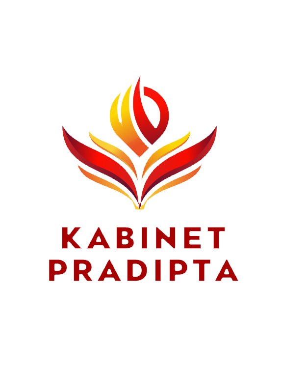

<div align="center">
  
  
  # Web Portal HIMA Informatika UTI 🚀
  
  **Platform Digital Resmi Himpunan Mahasiswa Informatika Universitas Teknokrat Indonesia**
  <br>
  *Premium, Modern, dan Terintegrasi.*
  <br><br>

  [](https://laravel.com)
  [](https://php.net)
  [](https://www.mysql.com/)
  [](https://getbootstrap.com/)
</div>

<hr>

## ✨ Tentang Proyek

Website ini merupakan portal resmi untuk **HIMA Informatika Universitas Teknokrat Indonesia**. Dirancang dengan UI/UX bertema **Premium Dark Mode**, website ini tidak hanya berfungsi sebagai profil organisasi, tetapi juga sebagai pusat layanan digital terintegrasi untuk seluruh mahasiswa Informatika.

### 🌟 Layanan Utama (Services)
- 🗣️ **Serasi (Sistem Aspirasi):** Wadah bagi mahasiswa untuk menyalurkan aspirasi, kritik, dan saran secara mudah dan terstruktur. Tersedia juga panel admin untuk meninjau dan merespons aspirasi.
- 📊 **Penilaian Keaktifan Anggota:** Terintegrasi langsung dengan platform monitoring keaktifan pengurus.
- 🎓 **Sertifikat Generator:** Layanan terintegrasi untuk mencetak sertifikat kepanitiaan dan kegiatan HIMA secara otomatis.

---

## 🎨 Fitur Unggulan

- **Premium UI/UX:** Desain modern dengan sentuhan _glassmorphism_, animasi mikro, dan transisi halus.
- **Responsive Design:** Tampil memukau dan fungsional di perangkat seluler maupun desktop.
- **Admin Dashboard:** Panel manajemen aspirasi dan pengguna yang aman (RBAC).
- **Smooth Navigation:** Dropdown menu dan akses cepat layanan langsung dari navbar dan footer.
- **Direct Mail Protocol:** Sistem "Hubungi Kami" yang terhubung langsung ke email resmi institusi.

---

## 🛠️ Prasyarat Instalasi (Requirements)

Pastikan sistem Anda sudah terinstal:
- PHP >= 8.2
- Composer
- Node.js & NPM
- MySQL / MariaDB

---

## 🚀 Panduan Instalasi (Setup Guide)

Ikuti langkah-langkah berikut untuk menjalankan proyek ini di *local machine* Anda:

### 1. Clone Repository
```bash
git clone https://github.com/HafisYulianto/Web-HIMA-Informatika---UTI.git
cd Web-HIMA-Informatika---UTI
```

### 2. Install Dependencies
```bash
# Install PHP packages
composer install

# Install Node.js packages
npm install
npm run build
```

### 3. Konfigurasi Environment
Salin file `.env.example` menjadi `.env` lalu sesuaikan konfigurasi database Anda.
```bash
cp .env.example .env
```
Buka file `.env` dan atur koneksi MySQL Anda:
```env
DB_CONNECTION=mysql
DB_HOST=127.0.0.1
DB_PORT=3306
DB_DATABASE=nama_database_anda
DB_USERNAME=root
DB_PASSWORD=
```

### 4. Setup Database & Key
Generate *application key* dan jalankan migrasi database beserta seeder-nya untuk membuat akun admin default.
```bash
php artisan key:generate
php artisan migrate:fresh --seed
```
*(Catatan: Akun admin default akan dibuat sesuai konfigurasi di dalam `DatabaseSeeder.php`)*

### 5. Jalankan Aplikasi Server
```bash
# Jalankan server Laravel
php artisan serve

# (Opsional) Jika sedang mengedit CSS/JS, jalankan Vite di terminal lain
npm run dev
```
Akses aplikasi melalui browser di: `http://localhost:8000`

---

## 🔐 Hak Akses (Credentials)

Untuk masuk ke dalam panel admin, gunakan kredensial berikut (pastikan Anda sudah menjalankan `php artisan migrate --seed`):
- **Email:** `hima_informatika@teknokrat.ac.id`
- **Password:** `8februari2001` *(Sesuai konfigurasi di seeder)*

---

## 👨‍💻 Pengembang (Developer)

Dikembangkan dan dikelola oleh **Hafis Yulianto** dan Tim HIMA Informatika UTI.
- 🌐 [Portfolio Developer](https://portfolio-hafisyulianto.vercel.app/)
- 📧 hima_informatika@teknokrat.ac.id

<div align="center">
  <br>
  <i>"Wadah pengembangan diri dan profesionalisme bagi mahasiswa informatika."</i>
</div>
